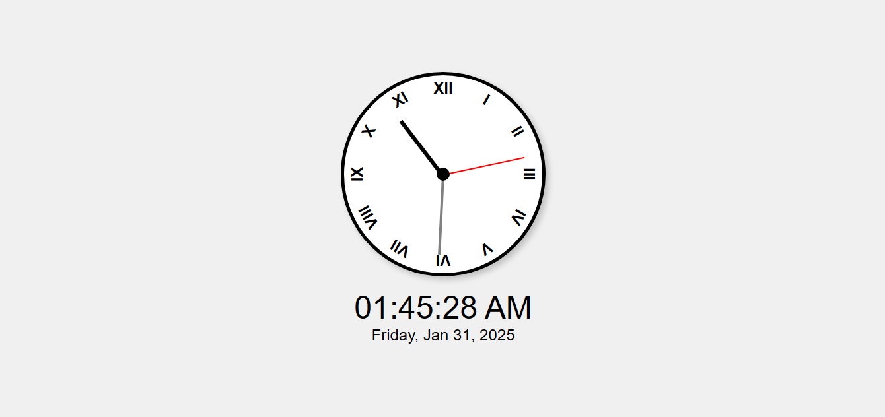

# Analog and Digital Clock

A real-time Analog and Digital Clock displaying current time and date with a stylish UI.

## Features

- **Analog Clock**: Classic clock interface with hour, minute, and second hands.
- **Digital Clock**: Displays current time in 12-hour format with AM/PM.
- **Live Updates**: Updates every second to show real-time changes.
- **Current Date Display**: Shows the full date including weekday.
- **Elegant and Responsive Design**: Works seamlessly on different screen sizes.

## Demo

 <!-- Replace with an actual screenshot of your clock -->

## Technologies Used

- **HTML** - Structure of the clock.
- **CSS** - Styling and layout.
- **JavaScript** - Handles clock functionality and real-time updates.

## How to Use

1. Clone the repository:

   ```bash
   git clone https://github.com/your-username/analog-digital-clock.git
   ```

2. Navigate to the project folder and open `index.html` in your web browser.
3. The clock will start running automatically, updating every second.

## File Structure

```
clock-project/
│
├── index.html     # Main HTML file
├── styles.css     # CSS styles
├── script.js      # JavaScript functionality
└── assets/
    ├── screenshot.png  # Demo image of the clock (optional)
```

## How it Works

### Analog Clock
- Uses CSS and JavaScript to rotate hands dynamically based on the current time.

### Digital Clock
- Uses JavaScript's `toLocaleTimeString()` to display time in AM/PM format.

### Real-Time Updates
- The script runs `setInterval()` every second to refresh the clock hands and digital time.

## Future Enhancements

- **Multiple Time Zones**: Add the ability to switch between different time zones.
- **Dark Mode**: A toggle switch to enable dark mode.
- **Customizable Styles**: Users can modify themes and layouts.

## Contributing

Feel free to fork this repository and submit pull requests for improvements. All contributions are welcome!

## Author

**Shubham**

