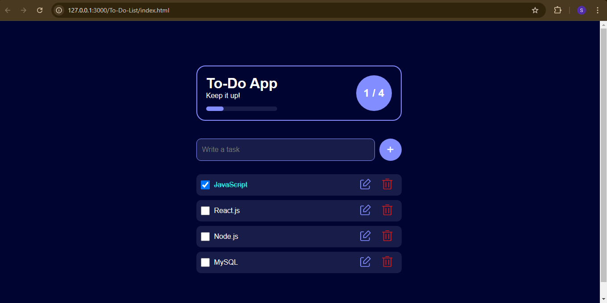

# To-Do App

A simple To-Do list application where you can add, delete, and edit tasks, with progress tracking and task completion stats.

## Features

- **Add Tasks**: Add new tasks to your list.
- **Mark Tasks as Completed**: Check off tasks once they're done.
- **Edit Tasks**: Edit your tasks as needed.
- **Delete Tasks**: Remove tasks you no longer need.
- **Progress Tracker**: Visual progress bar showing completed vs total tasks.
- **Local Storage**: Your tasks are saved in the browser's local storage, so they're preserved even after refreshing the page.
- **Confetti Animation**: Celebrate when all tasks are completed.

## Demo

 <!-- Replace this with an actual screenshot of your app -->

## Technologies Used

- HTML5
- CSS3
- JavaScript
- Local Storage
- Confetti Animation (using TSParticles library)

## How to Use

1. Clone this repository to your local machine:

   ```bash
   git clone https://github.com/your-username/todo-app.git
   ```

2. Open the `index.html` file in your web browser.

3. Add tasks, mark them as complete, edit or delete them as necessary.

4. Track your progress with the progress bar.

## File Structure

```
todo-app/
│
├── index.html          # Main HTML file
├── Style.css           # Styles for the app
├── Script.js           # JavaScript functionality
└── img/
    ├── edit.png        # Edit task icon
    ├── bin.png         # Delete task icon
    └── demo-image.png  # Demo image for the app (optional)
```

## How it Works

### Task Management

- **Adding a Task**: Type your task into the input field and press the "+" button.
- **Completing a Task**: Click the checkbox next to a task to mark it as completed.
- **Editing a Task**: Click the edit icon to modify an existing task.
- **Deleting a Task**: Click the delete icon to remove a task.

### Progress Tracking

The progress bar updates as you mark tasks as completed. It shows the percentage of tasks completed.

### Local Storage

The app stores the tasks in the browser's local storage. This means that your tasks will persist across page refreshes.

### Confetti Animation

When all tasks are marked as complete, a fun confetti animation will play as a celebration!

## Contributing

Feel free to fork this repository and contribute by submitting pull requests. All contributions are welcome!

---

